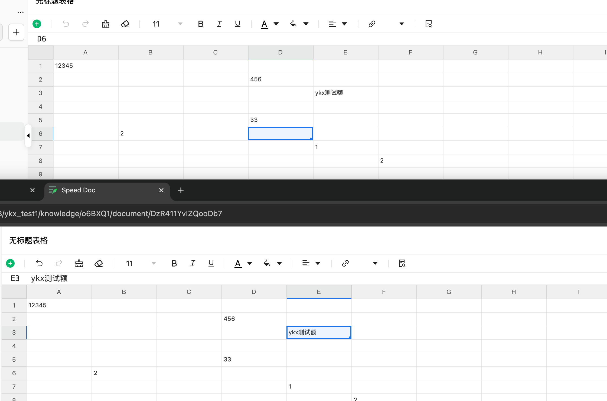

# Speed Knowledge Client

一个类似语雀的知识库管理系统前端应用，支持知识库创建、文档编辑、协同编辑等功能。

## 📋 项目简介

Speed Knowledge Client 是一个现代化的知识管理平台前端应用，提供知识库管理、文档编辑、团队协作等功能。采用 Vue 3 + TypeScript 构建，提供流畅的用户体验和强大的编辑能力。

### 项目部分截图

#### 默认看板


#### 协同编辑


#### 表格文档



## 📅 更新日志

### 2026-06-01 — 表格列筛选

#### 📊 Speed Sheet 筛选

- ✅ 列筛选：按内容 / 颜色 / 条件；表头绿色漏斗 + 数据区绿色实线描边
- ✅ 私有筛选按 `userId` 写入 Y.Doc `sheetFilterPrivate`；共享筛选写入 `sheetFilter`
- ✅ 编辑态：Hocuspocus 实时协同；查看态：静态 `node_json` 快照（对齐语雀，刷新更新）
- ✅ 服务端落库 `toSnapshot()` 含 `sheetFilter` / `sheetFilterPrivate`，查看态可恢复筛选
- ✅ `SheetEditor` 传入 `filterUserId`（`useUserStore`）

详见 speed-sheet：[`docs/filter-notes.md`](https://github.com/whateveryoudo/speed-sheet/blob/main/docs/filter-notes.md)

### 2026-05-29 — 接入 Speed Sheet & 协同能力增强

#### 📊 表格文档（Speed Sheet 接入）

- ✅ 新增 **表格** 文档类型（`DocumentType.SHEET`），与 Word 文档并列支持
- ✅ 目录树「+」菜单支持创建 **文档 / 表格** 两种类型
- ✅ 集成 [`@speed-sheet/vue3-antd`](https://github.com/whateveryoudo/speed-sheet) 作为表格编辑器
- ✅ 阅读模式：从 `node_json` 加载 `WorkbookSnapshot` 快照渲染只读表格
- ✅ 编辑模式：通过 Yjs + Hocuspocus 接入协同服务，实时同步单元格数据
- ✅ 开发环境支持 `pnpm link` 联调 speed-sheet 源码（Vite alias + `yjs` dedupe）

#### 🤝 协同操作增强

- ✅ 抽取 `useDocumentCollaborators`，Word / Sheet 共用顶部 **在线协作者头像条**
- ✅ 抽取 `useSheetCollaboration`，表格编辑模式独立管理 Y.Doc 与 Hocuspocus Provider
- ✅ 表格协同：Awareness 广播在线用户，编辑页实时展示协作者状态（表格内不做远程选区/正在编辑等画布指示器，与腾讯文档、语雀等产品一致）
- ✅ 编辑器组件拆分：`WordEditor` / `SheetEditor`，文档页按类型自动路由

#### 🔧 工程调整

- ✅ `useKnowledgeStore` 按文档类型分流内容：`documentContentJson`（Word）/ `documentSheetSnapshot`（Sheet）
- ✅ 新增 `sheet.svg` 图标资源，目录树展示表格节点
- ✅ 环境变量 `VITE_APP_COLLABORATE_URL` 统一配置协同 WebSocket 地址

## 🛠️ 技术栈

### 核心框架
- **Vue 3** - 渐进式 JavaScript 框架
- **TypeScript** - 类型安全的 JavaScript 超集
- **Vite** - 下一代前端构建工具
- **Vue Router** - 官方路由管理器
- **Pinia** - Vue 官方状态管理库

### UI 框架与组件
- **Ant Design Vue** - 企业级 UI 组件库
- **Speed Components UI** - 基于 Ant Design Vue 的二次封装组件库
- **UnoCSS** - 即时原子化 CSS 引擎

### 编辑器
- **Speed Tiptap Editor** - 基于 Tiptap 的富文本编辑器，支持协同编辑
- **Speed Sheet** (`@speed-sheet/vue3-antd`) - 基于 Yjs 的在线表格编辑器，支持公式、多 Sheet 页签与协同编辑
- **Yjs + Hocuspocus Provider** - 表格文档实时协同底层

### 工具库
- **@vueuse/core** - Vue Composition API 工具集合
- **axios** - HTTP 客户端
- **dayjs** - 日期处理库
- **lodash-es** - JavaScript 工具库

## 📁 项目结构

```
speed-knowledge-client/
├── apps/
│   └── web/                    # 主应用
│       ├── src/
│       │   ├── assets/         # 静态资源
│       │   ├── components/     # 全局组件
│       │   │   ├── global/     # 全局通用组件
│       │   │   └── ...         # 业务组件
│       │   ├── views/          # 页面视图
│       │   │   ├── dashboard/  # 首页/仪表盘
│       │   │   ├── knowledge/  # 知识库相关页面
│       │   │   └── login/      # 登录页面
│       │   ├── router/         # 路由配置
│       │   ├── store/          # Pinia 状态管理
│       │   ├── hooks/          # 组合式函数
│       │   └── utils/          # 工具函数
│       └── ...
├── packages/
│   ├── sk-api/                 # API 请求封装
│   ├── sk-types/               # TypeScript 类型定义和一些字典导出
│   └── sk-utils/               # 工具函数库
└── ...
```

## ✨ 已完成功能

### 📚 知识库管理
- ✅ 知识库创建与管理
- ✅ 知识库分组
- ✅ 知识库图标自定义
- ✅ 知识库分享与权限设置

### 👥 团队协作
- ✅ 人员邀请（链接方式）
- ✅ 协作者管理
- ✅ 协同权限设置（只读/编辑/管理员）

### 📝 文档编辑
- ✅ 文档创建（支持 **Word** / **Sheet** 两种类型）
- ✅ 富文本编辑（基于 Tiptap）
- ✅ 在线表格编辑（基于 Speed Sheet）
- ✅ 文档目录树管理（按类型展示不同图标）
- ✅ 文档搜索
- ✅ 文档浏览历史记录
- ✅ 文档编辑历史记录

### 🤝 实时协同编辑
- ✅ Word 文档多人实时协同编辑（Tiptap + Hocuspocus）
- ✅ Sheet 表格多人实时协同编辑（Yjs + Hocuspocus）
- ✅ 协同在线人员状态显示（Word / Sheet 统一头像条）
- ✅ 表格协同 Awareness 在线感知（远程选区光标能力已封装，UI 待接入）

### 📄 文档查看
- ✅ OnlyOffice 文档预览
- ✅ 文档附件管理

## 🚧 TODO

### 🔐 权限系统
- ⏳ 细粒度权限校验
- ⏳ 文档级权限控制
- ⏳ 操作日志记录

### 📄 文档类型扩展
- ✅ 表格文档（Sheet）— 已接入 Speed Sheet
- ⏳ 表格远程选区光标 UI 展示
- ⏳ 支持更多文档类型（PPT、思维导图等）
- ⏳ 文档模板功能
- ⏳ 文档导入导出(后端实现)
- ...
### 📊 文档细节优化
- ⏳ 文档版本管理
- ⏳ 文档评论功能
- ⏳ 文档标签系统
- ⏳ 文档关联关系
- ...

### 🎨 用户体验优化
- ⏳ 主题切换（亮色/暗色）
- ⏳ 多语言支持
- ⏳ 快捷键自定义
- ⏳ 移动端适配

## 🔗 相关项目

### 编辑器
- **[Speed Tiptap Editor](https://github.com/whateveryoudo/speed-tiptap-editor)**  
  基于 Tiptap 的富文本编辑器，提供丰富的编辑功能和扩展能力。

- **[Speed Sheet](https://github.com/whateveryoudo/speed-sheet)**  
  基于 Yjs 的在线表格编辑器，支持公式计算、多 Sheet 页签、行列操作与协同编辑。

### 后端 API
- **[Speed Knowledge Server](https://github.com/whateveryoudo/speed-knowledge-server)**  
  后端服务，提供 RESTful API 接口。
  - **主接口**: Python FastAPI
  - **协同服务**: Node.js NestJS

### 业务组件库
- **[Speed Components UI](https://github.com/whateveryoudo/speed-components-ui)**  
  基于 Ant Design Vue 的二次封装组件库，提供业务场景下的常用组件。

### 文档预览
- **[OnlyOffice](https://github.com/whateveryoudo/onlyoffice)**  
  集成 OnlyOffice 实现文档在线预览和编辑功能。

## 🚀 快速开始

### 环境要求

- Node.js: `^20.19.0 || >=22.12.0`
- pnpm: `>=8.0.0`

### 安装依赖

```bash
pnpm install
```

### 开发模式

```bash
pnpm dev
```

应用将在 `http://localhost:5173` 启动（端口可能因配置而异）。

### 构建生产版本

```bash
pnpm build
```

### 类型检查

```bash
pnpm type-check
```

### 代码检查与格式化

```bash
# 代码检查
pnpm lint

# 代码格式化
pnpm format
```

### 运行测试

```bash
pnpm test:unit
```

## 📖 使用说明

### 环境变量配置

在项目根目录创建 `.env` 文件，配置以下变量：

```env
# API 基础地址
VITE_APP_BASE_URL=http://localhost:8010

# 代理地址（用于开发环境）
VITE_APP_PROXY_URL=http://localhost:5173

# 协同服务 WebSocket 地址（NestJS Hocuspocus）
VITE_APP_COLLABORATE_URL=ws://localhost:3000
```

### 开发模式切换

```bash
# 默认模式（连接 Python FastAPI）
pnpm dev

# Node.js 模式（连接 NestJS，目前node暂未开发模块）
pnpm dev:node
```

## 🤝 贡献

欢迎提交 Issue 和 Pull Request！

## 📄 许可证

MIT License
